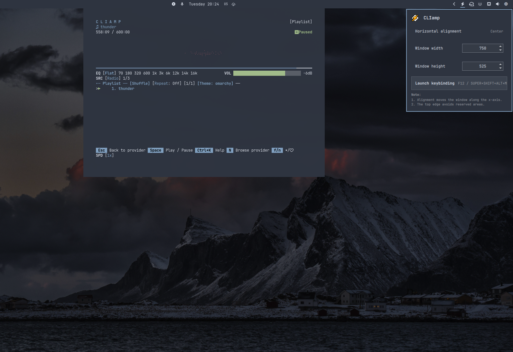

# CLIamp quake

A Quake-style drop-down for CLIamp. Open it from the bar or your music shortcut,
then choose its size and horizontal position. Under 1,000 lines of core code,
with measured idle plugin overhead below 4 MiB, excluding CLIamp and its terminal.

[][demo]

[Watch the demo][demo] — changing alignment, resizing, and showing or hiding the
player. The key and mouse overlay in the video is a separate tool.

## Use

- **Left-click** the lightning bolt to show or hide CLIamp.
- **Right-click** to set Left, Center, or Right alignment and adjust its size.
- Size arrows resize immediately in 50 px steps. Typed values apply on **Enter**
  or when you click elsewhere in the panel.
- Select **Launch keybinding** to edit your shortcut in Omarchy's editor.

The default size is **1200 x 600**, centered below the bar. Larger sizes fit
within the available screen space. Regular CLIamp windows are unaffected.

Your existing CLIamp music shortcut works with the drop-down. Omarchy's default
is **Super+Shift+Alt+M**; the demo uses a custom **F12** binding.

## Install

Requires Omarchy Quattro, Hyprland **0.56.2 or newer**, and CLIamp. The helpers
use Bash, jq, Lua, and hyprctl, available in a standard Omarchy installation.

```bash
omarchy plugin add \
  https://github.com/omarchy-QOL/omarchy-cliamp-control.git --enable
```

No extra setup is needed. If you have a `~/.local/share/cliamp/thunder.webm`
file, it plays automatically when CLIamp opens. Otherwise, CLIamp starts
normally.

## Update or remove

```bash
omarchy plugin update io.github.ilyazar.cliamp
```

```bash
omarchy plugin remove io.github.ilyazar.cliamp
```

Removal closes the plugin's drop-down and restores your original music
shortcuts. Your CLIamp configuration stays unchanged.

## License

MIT.

[Development and checks](docs/development.md).

[demo]:
  https://omarchy-qol.github.io/omarchy-cliamp-control/assets/published/cliamp-quake.mp4
